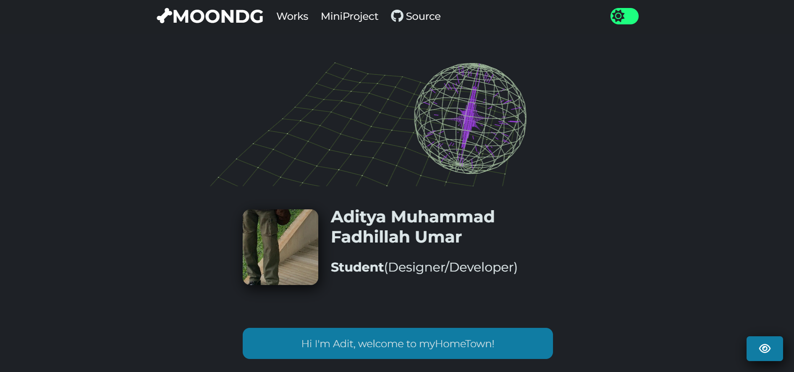

# Adit's Hometown

This is my web portfolio showcasing various projects I've worked on.

## Front Page

You can view my web portfolio live [here](https://adityamfu.github.io/moondg/).

## Description

This portfolio is created to showcase the projects I've worked on in web development. I hope you find the projects interesting and informative.

## STACK

- [Vanta.js](https://www.vantajs.com/) : A JavaScript library that easily add dynamic and interactive.
- [JavaScript](https://www.javascript.com/) : A scripting language for creating dynamic web page content. It creates elements for improving site visitors' interaction with web pages.
- [Vanila CSS](https://www.w3.org/Style/CSS/) : Refers to the use of plain or pure Cascading Style Sheets (CSS) without any additional libraries or preprocessors.
- [HTML5](https://html.spec.whatwg.org/multipage/) : Is the latest version of the Hypertext Markup Language used to create web pages and applications.

## How to Run

If you want to run these projects locally, you can follow the steps below:

1. Clone this repository to your computer :[https://github.com/adityamfu/moondg.git](https://github.com/adityamfu/moondg.git)

2. Navigate to the project directory : .cd portofolio-nname.

3. Open the HTML file of the project you want to run in a web browser.

## License

This project is licensed under the [MIT License](LICENSE.md).
